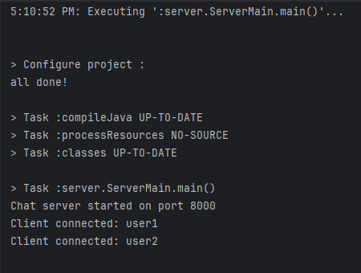
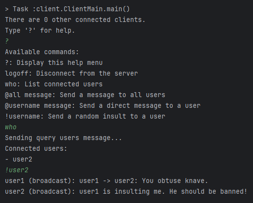
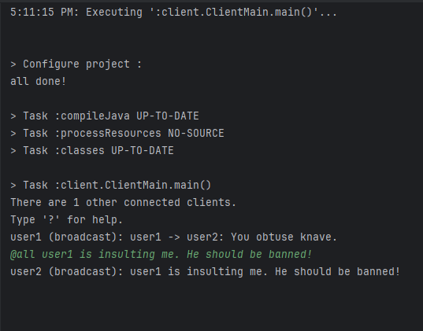

# Chatroom Application

## Overview
In this project, we implement a simple chat room application with a client-server architecture. We have a server which manages client connections, relays messages, and supports private and public messaging. We have also implemented a terminal-based interface for users to interact with the chat room.

## Features
1. **Public Messages**: Broadcast messages to all connected users.
2. **Private Messages**: Send direct messages to specific users.
3. **User Management**: Query connected users and disconnect gracefully.
4. **Command Menu**: Help menu for available commands.
5. **Insults**: Randomly generate and send insults to specific users.

---

## How to Run the Application

### Prerequisites
1. Java Development Kit (JDK) installed.
2. IntelliJ IDEA or any other Java IDE (optional).
3. Terminal or Command Prompt access.

### Entry Points
- **Server**: `server.ServerMain`
- **Client**: `client.ClientMain`

### IntelliJ IDEA Instructions
1. Open the project in IntelliJ IDEA.
2. Create a new run configuration:
    - For the server, set the main class to `server.ServerMain` and specify the port as a program argument.
    - For the client, set the main class to `client.ClientMain` and specify the server address, port, and username as program arguments.
3. Run the configurations to start the server and client.

---

## Key Classes and Methods

### Server-Side
1. **`ChatServer`**
    - Manages client connections and communication.
    - Key methods:
        - `broadcastMessage`: Sends messages to all connected clients.
        - `directMessage`: Sends a message to a specific client.
2. **`ClientHandler`**
    - Handles communication with a single client.
    - Key methods:
        - `processMessage`: Processes incoming client messages. Based on message type provided, it calls corresponding methods to handle it.
        - `handleSendInsult`: Generates and sends a random insult.
3. **`ConnectedClient`**
    - Represents a connected client with username and output stream.

### Client-Side
1. **`ChatClient`**
    - Handles user interaction and server communication.
    - Key methods:
        - `sendBroadcastMessage`: Sends a public message to the server.
        - `sendDirectMessage`: Sends a private message to a user.
2. **`ServerListener`**
    - Listens for incoming server messages.
    - Key methods:
        - `processMessage`: Handles different types of server messages.

### Utility
- **`MessageProtocol`**
    - Encodes and decodes messages according to the chat protocol.
    - Key methods:
        - `writeString`: Writes a string to a stream.
        - `readString`: Reads a string from a stream.

---

## Ensuring Correctness
1. **Protocol Compliance**: All messages follow a predefined protocol.
2. **Thread Safety**: Multi-threading is used for handling concurrent clients.
3. **Error Handling**: Invalid commands and messages are gracefully handled.
4. **Testing**: Performed unit testing to test individual components. Also, manually tested the application with multiple clients sending simultaneous messages.

---

## Example Outputs

### Server Output

### Client Output
#### Client A:

#### Client B:

---

## Additional Notes
- Ensure the server is running before starting any clients.
- Server supports up to 10 clients at a time.
- The server enforces username uniqueness.
- For enhancements or debugging, logs are printed to the console for both server and clients.

